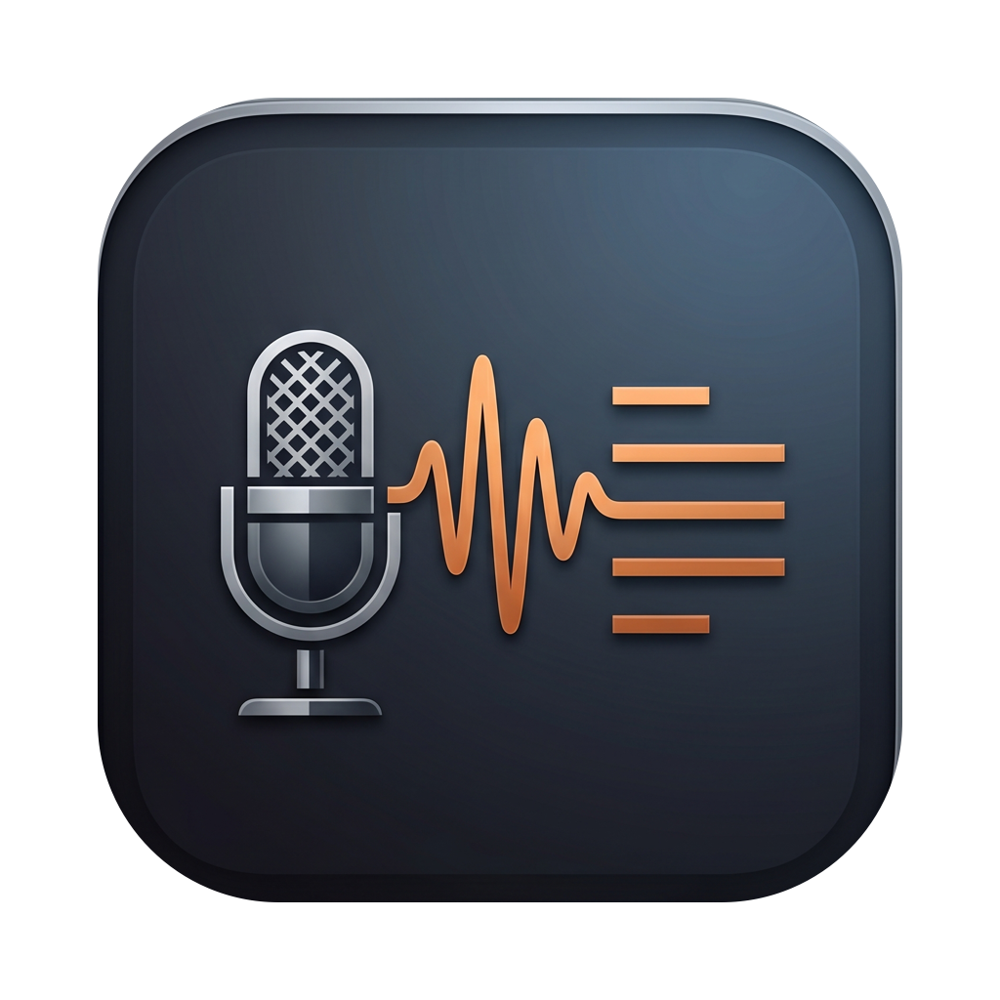
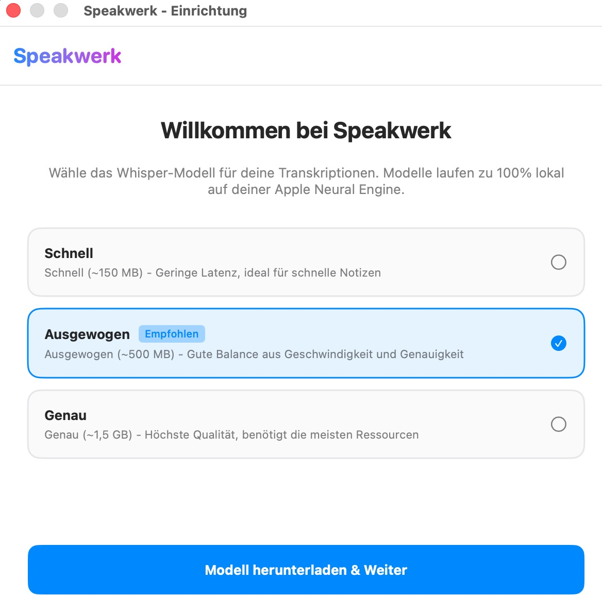

<p align="center">
  
</p>

# Speakwerk

Speakwerk ist ein lokales Voice-to-Text-Tool für macOS. Über einen konfigurierbaren globalen Hotkey lässt sich eine Aufnahme starten. Nach Abschluss der Aufnahme wird die Transkription lokal via WhisperKit ausgeführt, im Verlauf gespeichert und der Text direkt an der aktuellen Cursorposition eingefügt.

Das Projekt ist kostenlos, Open Source (MIT-Lizenz) und speichert/verarbeitet alle Audiodaten und Transkripte vollständig lokal (keine Cloud-Datenbank, kein Web-Backend).

<p align="center">
  
</p>

## 📦 Installation (für Nutzer)

1. Laden Sie die Datei `Speakwerk-Dist.zip` der neuesten Version von der [Releases-Seite](https://github.com/salutaris91/Speakwerk/releases) herunter.
2. Entpacken Sie das Archiv und verschieben Sie `Speakwerk.app` in den Ordner **Programme**.
3. **Wichtig — erster Start:** Folgen Sie der Anleitung im nächsten Abschnitt, da macOS die App beim ersten Öffnen blockiert.

> ### ⚠️ Erster Start: macOS-Sicherheitswarnung (Gatekeeper)
>
> Speakwerk ist **nicht von Apple notariert**, da das Projekt ohne kostenpflichtigen Apple Developer Account entwickelt wird. macOS blockiert die App deshalb beim ersten Öffnen mit einer Warnung wie *„Speakwerk kann nicht geöffnet werden"*. **Das ist normal und kein Hinweis auf Schadsoftware** — der gesamte Quellcode ist in diesem Repository öffentlich einsehbar.
>
> **So öffnen Sie die App trotzdem (einmalig nötig):**
>
> **macOS 15 (Sequoia) oder neuer:**
> 1. Versuchen Sie, die App per Doppelklick zu öffnen (die Warnung erscheint — klicken Sie auf „Fertig").
> 2. Öffnen Sie **Systemeinstellungen → Datenschutz & Sicherheit**.
> 3. Scrollen Sie nach unten zum Abschnitt „Sicherheit" — dort erscheint der Hinweis zu Speakwerk.
> 4. Klicken Sie auf **„Dennoch öffnen"** und bestätigen Sie mit Ihrem Passwort bzw. Touch ID.
>
> **macOS 14 (Sonoma):**
> 1. Klicken Sie mit der **rechten Maustaste** (bzw. Ctrl-Klick) auf `Speakwerk.app`.
> 2. Wählen Sie **„Öffnen"** und bestätigen Sie den Dialog erneut mit **„Öffnen"**.
>
> Danach startet Speakwerk dauerhaft ohne weitere Nachfrage. Auch automatische Updates über die integrierte Update-Funktion sind davon nicht betroffen — sie sind kryptografisch signiert (Sparkle/Ed25519).

## Systemvoraussetzungen

*   **macOS**: 14.0 (Sonoma) oder neuer.
*   **Architektur**: Apple Silicon (M1 oder neuer). Intel-Macs werden aktuell nicht unterstützt.

## Tech-Stack

*   **Sprache**: Swift
*   **Build-System**: Swift Package Manager (SPM) (kein Xcode-GUI-Zwang)
*   **Transkription**: WhisperKit (CoreML & Apple Neural Engine)
*   **Globaler Hotkey**: KeyboardShortcuts (Version 1.15.0)
*   **Auto-Updates**: Sparkle (Version 2.x)
*   **App-Typ**: Accessory-App (NSStatusItem in der Menüleiste, läuft ohne Dock-Icon)

---

## Installation & Build für Entwickler

### 1. Lokales Bauen (Kompilierung)
Verwenden Sie den Swift Package Manager für eine schnelle lokale Kompilierung:
```bash
swift build
```

### 2. App-Bundle erstellen und verpacken
Das Skript `scripts/build.sh` kompiliert die Anwendung im Release-Modus, erstellt das App-Bundle unter `build/Speakwerk.app`, bettet Sparkle.framework (bereinigt um ungenutzte XPC-Services für eine non-sandboxed App) ein und führt einen automatischen Smoke-Test durch:
```bash
./scripts/build.sh
```

---

## Auto-Update System (Sparkle 2.x)

Speakwerk nutzt das Sparkle-Framework für automatische Hintergrund-Updates und manuelle Update-Prüfungen über GitHub Releases.

### 1. Ed25519-Schlüsselpaar generieren (einmalig)
Updates müssen kryptografisch signiert werden, um von Sparkle akzeptiert zu werden. Generieren Sie ein Schlüsselpaar im Projektverzeichnis:
```bash
./.build/artifacts/sparkle/Sparkle/bin/generate_keys
```
*   Der **öffentliche Schlüssel** wird in der `Resources/Info.plist` unter dem Key `SUPublicEDKey` eingetragen.
*   Der **private Schlüssel** wird automatisch sicher in Ihrem lokalen macOS-Schlüsselbund (Keychain) abgelegt. **Wichtig:** Sichern Sie diesen Schlüssel zusätzlich an einem sicheren Ort. Geht er verloren, können bestehende Installationen keine automatischen Updates mehr verifizieren!

### 2. Update-Prozess & Verteilung
Wenn Sie eine neue Version veröffentlichen:

1.  Erhöhen Sie die Marketing-Version (`CFBundleShortVersionString`) und die Build-Nummer (`CFBundleVersion`) in der `Resources/Info.plist`.
2.  Führen Sie `./scripts/build.sh` aus, um das neue App-Bundle und das finale Archiv `build/Speakwerk-Dist.zip` zu erstellen.
3.  Erstellen Sie einen temporären Veröffentlichungs-Ordner und generieren Sie den Appcast mit Ihrer Ziel-Download-URL (wobei `<tag>` dem GitHub-Release-Tag entspricht, z. B. `v1.1.0`):
    ```bash
    mkdir -p build/release-assets
    cp build/Speakwerk-Dist.zip build/release-assets/
    ./.build/artifacts/sparkle/Sparkle/bin/generate_appcast \
      --download-url-prefix "https://github.com/salutaris91/Speakwerk/releases/download/<tag>/" \
      build/release-assets/
    ```
4.  Kopieren Sie die generierte `appcast.xml` aus `build/release-assets/appcast.xml` in das Root-Verzeichnis Ihres Repositories, committen Sie diese auf `main` und pushen Sie den Stand.
5.  Erstellen Sie ein neues GitHub-Release mit dem Tag `<tag>` und laden Sie die Datei `Speakwerk-Dist.zip` als Asset hoch.